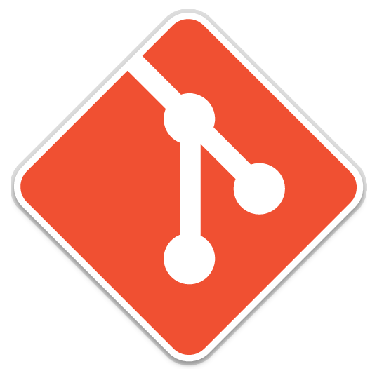
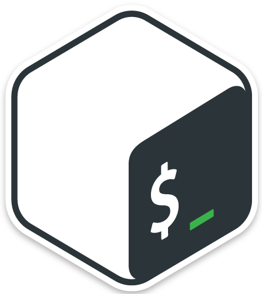
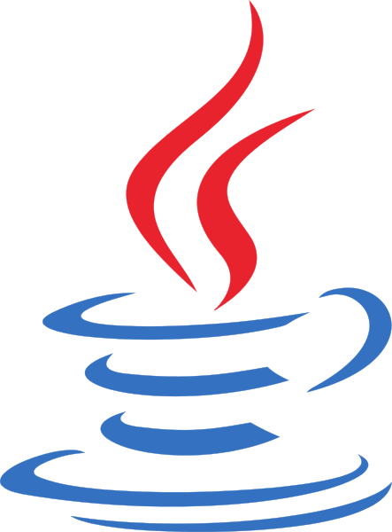
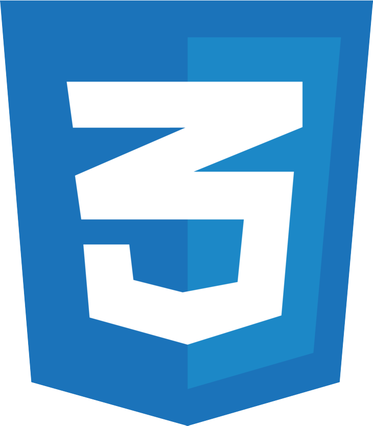
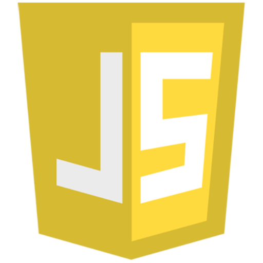

<!--h1 align="center">Hello World 👋 I'm <a href="https://flask-1-cidy.onrender.com">Ryan</a></h1-->
<h1 align="center">Hello World 👋 I'm Ryan</h1>

  
  
  
  
  
  
  
  
  

<h2 align="left">🎓 Education</h2>

  🤖 <i>MS in Artificial Intelligence &amp; Machine Learning (AI/ML).</i> 
  💻 <i>BS in Computer Science.</i> 
  📊 <i>Certificate in Data Science.</i>

<!-- **rt75272/rt75272** is a ✨ _special_ ✨ repository because its `README.md` (this file) appears on your GitHub profile.

Here are some ideas to get you started: -->
<h2 align="left">➕ Additional</h2>

  🌱 I’m currently working, learning, and looking to collaborate on AI/ML. 
  💬 Ask me about software development with AI/ML. 
  📫 How to reach me: rt75272@gmail.com.

